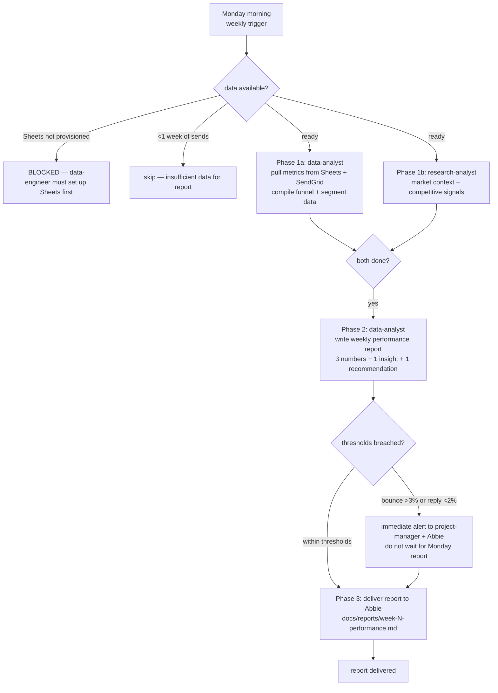

# Workflow SOP: campaign-performance-report

## Pipeline Overview

## Trigger

- **Weekly (recurring):** Every Monday before 09:00 EAT (East Africa Time), starting the week after first email batch sends
- **Real-time alert (event-driven):** Any time `sync_lead_state.py` or `send_email.py` logs a bounce rate >3% or the weekly rolling reply rate drops below 2% — triggers alert sub-path immediately without waiting for Monday

## Inputs Required

- Google Sheets `All Prospects` tab: contact_status, response_flag, quote_requested columns (all populated by sync_lead_state.py)
- Google Sheets `Campaign Stats` tab (aggregates — built by data-engineer)
- Google Sheets `Discovery Runs` tab (for discovery yield metrics)
- SendGrid delivery logs (or SMTP send logs) for open/click rates — requires `SENDGRID_API_KEY` for tracking
- At least 7 days of email sends completed before first report

## Pipeline

**Phase 1 — Data Collection — PARALLEL:**
- Agent: `data-analyst` — Role: Pull weekly metrics from Google Sheets + SendGrid: total sent, open rate, reply rate, bounce rate, quote requests, meetings booked; break down by segment (luxury resorts, boutique/lodges, villas/apartments/guesthouses); calculate week-over-week trend (up/down/flat + % change); check alert thresholds (bounce >3%, reply <2%) — Tool: Google Sheets API (GOOGLE_SHEETS_SERVICE_ACCOUNT_JSON), SendGrid API (SENDGRID_API_KEY) — Output: Raw metrics object for report generation
- Agent: `research-analyst` — Role: Compile 1-2 market intelligence signals relevant to this week's outreach (e.g., Zanzibar hotel occupancy trends, upcoming MICE events that affect procurement, competitor moves) — Tool: Tavily (web search) — Output: 1-2 sentence market context paragraph for inclusion in weekly report
- Gate: Both data outputs available → proceed to Phase 2. If Sheets API unavailable → data-analyst escalates to project-manager.

**Phase 2 — Report Generation — SEQUENTIAL:**
- Agent: `data-analyst` — Role: Write weekly performance report in strict format: **3 numbers** (the most important metrics this week — e.g., "Reply rate: 4.2% / Bounce rate: 1.1% / Quote requests: 3"), **1 insight** (what the data is telling us — e.g., "Boutique/lodge segment is responding 2× better than luxury resorts — shift emphasis"), **1 recommendation** (what to change this week — e.g., "Increase daily send quota to 50 for boutique segment; pause luxury resort sequence until insight validated"), plus full funnel table and segment breakdown — Tool: Write — Output: `docs/reports/week-[N]-performance.md`
- Alert path: If bounce rate >3% OR rolling reply rate <2% for 2 consecutive weeks → write alert message separately and deliver to project-manager + Abbie immediately; do not wait for Phase 3
- Gate: Report ≤1 page. Numbers accurate (spot-checkable against raw Sheets data). Recommendation is actionable (names a specific agent or tool to change).

**Phase 3 — Delivery — SEQUENTIAL:**
- Action: Report file saved to `docs/reports/week-[N]-performance.md`; project-manager notifies Abbie that report is ready
- Approver: Abbie (async review — no approval required unless recommendation involves pausing campaign or changing strategy)
- Decision: Abbie acts on recommendation → project-manager coordinates with relevant agents | no action → next week's cycle begins

## Output

- `docs/reports/week-[N]-performance.md` — weekly performance report (1-page max)
- Real-time alert to project-manager + Abbie if thresholds breached
- Updated `Campaign Stats` tab in Google Sheets (data-analyst maintains aggregates)

## Agents Referenced

- data-analyst
- research-analyst
- project-manager (delivers report notification to Abbie; acts on threshold alerts)

## MCPs / Tools Referenced

- Google Sheets API (via GOOGLE_SHEETS_SERVICE_ACCOUNT_JSON)
- SendGrid API (via SENDGRID_API_KEY) — open/click tracking
- Tavily MCP — market intelligence (research-analyst)

## Owner

data-analyst (owns report generation); project-manager (owns delivery + alert escalation)

## Last Updated

2026-05-07 — initial /workflow SOP authoring
