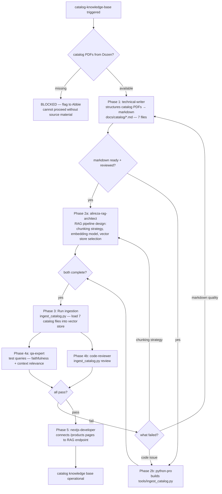

# Workflow SOP: catalog-knowledge-base

## Pipeline Overview

## Trigger

- Website-sprint Phase 3 begins (RAG must be ready before /products pages go live)
- Product catalog PDFs delivered by Dozen
- Catalog update from Dozen (re-run ingestion for changed categories)

## Inputs Required

- Product catalog PDFs from Dozen (all 7 categories: bath towels, bed linen, bedding, F&B, bathrobes, slippers, kitchen/sanitation)
- `ANTHROPIC_API_KEY` in `.env` (for embedding + query)
- Vector store decision: ChromaDB local (`VECTOR_STORE_PATH`) or Pinecone (`PINECONE_API_KEY`) — [to be finalized with Abbie before Phase 2]
- `tools/ingest_catalog.py` build by python-pro

## Pipeline

**Phase 1 — Catalog Structuring — SEQUENTIAL:**
- Agent: `technical-writer` — Role: Read all 7 product category PDFs; produce structured markdown for each category; format: consistent heading hierarchy, specs in tables (size, GSM, weight, color options, MOQ, indicative price range), no ambiguous abbreviations, chunk-friendly structure (each product = its own heading block) — Tool: Read (PDFs), Write — Output: `docs/catalog/towels.md`, `docs/catalog/bed-linen.md`, `docs/catalog/bedding.md`, `docs/catalog/fb-supplies.md`, `docs/catalog/bathrobes.md`, `docs/catalog/slippers.md`, `docs/catalog/kitchen-sanitation.md`
- Gate: All 7 files written, `alireza-rag-architect` confirms format is chunking-ready. If PDFs are incomplete or missing categories → flag to Abbie; produce partial catalog for available categories; track missing categories as open items.

**Phase 2 — Pipeline Design + Tool Build — PARALLEL:**
- Agent: `alireza-rag-architect` — Role: Design full RAG pipeline: chunking strategy (heading-based chunks, max 512 tokens, overlap 50 tokens); embedding model selection (text-embedding-3-small or equivalent via Anthropic); vector store configuration (ChromaDB local for MVP, Pinecone for production if scale demands); retrieval strategy (hybrid: keyword + semantic); evaluation criteria (faithfulness >90%, context relevance >0.8 on test query set); write 10 canonical test queries covering all 7 categories — Tool: Write (pipeline design doc at `docs/architecture/rag-pipeline.md`) — Output: RAG pipeline design doc + 10 test queries
- Agent: `python-pro` — Role: Build `tools/ingest_catalog.py`: reads all 7 markdown files, chunks per rag-architect spec, generates embeddings, loads to vector store; idempotent (safe to re-run; clears + reloads same category if re-run); progress logging; error handling for malformed chunks — Tool: Write, Bash — Output: Working `tools/ingest_catalog.py` with test on `docs/catalog/towels.md`
- Gate: Both outputs complete; ingest_catalog.py unit test passes on towels.md sample → proceed to Phase 3.

**Phase 3 — Ingestion — SEQUENTIAL:**
- Action: `python-pro` runs `tools/ingest_catalog.py` (dry_run=True first to validate chunk counts, then full run)
- Output: All 7 category files ingested; vector store populated; chunk count logged per category
- Gate: Chunk counts match expected range (towels: 30-60 chunks; all categories total: 150-300 chunks). Abnormal chunk count → investigate markdown format issue → back to Phase 1.

**Phase 4 — Review + Evaluation — PARALLEL:**
- Reviewer: `qa-expert` — Checks: Run all 10 canonical test queries from rag-architect; verify faithfulness >90% (answer matches source material); verify context relevance >0.8 (retrieved chunks are relevant to query); specific test queries must pass: "What GSM options are available for bath towels?", "What is the indicative price for the Bianca set?", "Do you have pool towels?", "Can you embroider the towels?", "What bathrobe GSM options do you carry?" — Tool: `tools/ingest_catalog.py` query interface — Output: Pass/fail per test query + aggregate faithfulness/relevance scores
- Reviewer: `code-reviewer` — Checks: ingest_catalog.py WAT invariant; no hardcoded vector store credentials; idempotency implementation correct; error handling for missing files; confidence-scored findings ≥80
- Gate: Both PASS (faithfulness >90%, all 10 test queries pass, code APPROVED) → proceed to Phase 5. Failing test query → diagnose: markdown quality (back to Phase 1) or chunking (back to Phase 2a).

**Phase 5 — Website Integration — SEQUENTIAL:**
- Agent: `nextjs-developer` — Role: Connect /products and /products/[category] pages to RAG endpoint; when visitor asks product question in catalog view, query passes to `tools/ingest_catalog.py` via API route; response rendered in page — Tool: Bash (next dev), Write — Output: /products pages functional with RAG-backed product Q&A
- Gate: /products page end-to-end test passes (qa-expert verifies in Phase 4c of website-sprint SOP).

## Output

- `docs/catalog/*.md` — 7 structured product catalog markdown files (RAG-ready)
- `docs/architecture/rag-pipeline.md` — pipeline design doc
- Operational RAG system: product questions answered with faithfulness >90%
- /products pages on website connected to catalog knowledge base

## Agents Referenced

- technical-writer
- alireza-rag-architect
- python-pro
- nextjs-developer
- qa-expert
- code-reviewer
- project-manager (tracks PDF delivery dependency from Dozen)

## MCPs / Tools Referenced

- `tools/ingest_catalog.py`
- Vector store: ChromaDB (local, `VECTOR_STORE_PATH`) or Pinecone (`PINECONE_API_KEY`)
- Claude API (via ANTHROPIC_API_KEY) — embeddings + retrieval

## Owner

alireza-rag-architect (pipeline design); technical-writer (catalog content)

## Last Updated

2026-05-07 — initial /workflow SOP authoring
