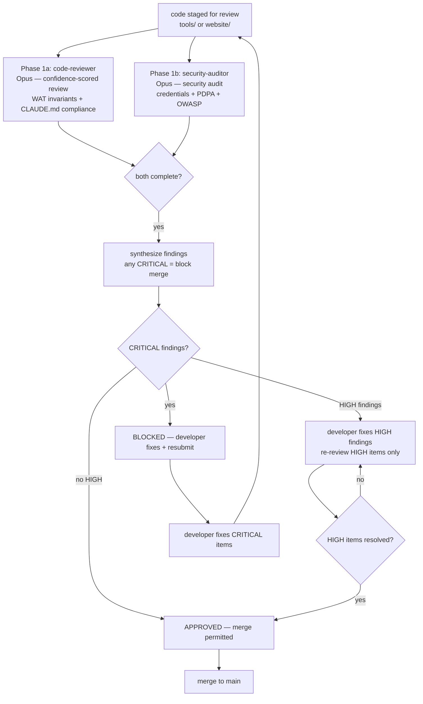

# Workflow SOP: code-review-cycle

## Pipeline Overview

## Trigger

- Any code staged for merge in `tools/` (Python tools) or `website/` (Next.js components)
- Plugin bundle: `plugin-pr-review-toolkit` — fires automatically on every pre-merge submission; invokes `code-reviewer` + `security-auditor` in a single parallel message (never one without the other)
- Also triggered on first build of any new tool during any SOP's production phase

## Inputs Required

- Git diff of staged changes (preferred) or full file for new files
- WAT invariant checklist from `.claude/CLAUDE.md` § Project-Specific Operating Rules
- `docs/1-brief.md` constraints (no hardcoded credentials, WAT mandatory)
- For security-auditor: prospect PII scope from `docs/2-context.md` (Tanzania PDPA 2022 context)

## Pipeline

**Phase 1 — Parallel Review — PARALLEL (both MUST run; never one without the other):**
- Reviewer: `code-reviewer` (Model: Opus) — Checks: WAT invariant compliance (tools are deterministic, no agent IO execution), confidence-scored findings (only surface ≥80 confidence), CLAUDE.md compliance (no hardcoded credentials, all secrets via python-dotenv), TypeScript strict mode for website code, test coverage for tool functions, WAT rule: every tool must have dry_run=True mode. Format: `[CONFIDENCE: 92][CRITICAL] SQL injection risk at tools/send_email.py:47`. Verdict: APPROVED / REQUEST CHANGES / BLOCKED.
- Reviewer: `security-auditor` (Model: Opus) — Checks: Credential exposure (.env loading, no API keys in code), PII handling (prospect emails/phones/names in logs, transit encryption), OWASP Top 10 for website components (XSS, CSRF, injection), SMTP relay security, WABA token handling. Severity: CRITICAL / HIGH / MEDIUM / LOW / INFO. Format: `[SEVERITY: HIGH] Prospect email logged in plaintext at tools/triage_reply.py:89`.
- Gate: Both reviews complete with written verdicts → proceed to finding synthesis. If either reviewer is unavailable → do not merge; wait for both.

**Phase 2 — Finding Synthesis — SEQUENTIAL:**
- Responsibility: Project orchestrator (Abbie / main Claude session) synthesizes findings from both reviewers
- Rules:
  - Any CRITICAL from either reviewer → BLOCKED. No merge until all CRITICAL items fixed and re-reviewed.
  - Any HIGH from either reviewer → developer must fix before merge; re-review HIGH items only (not full review)
  - MEDIUM / LOW / INFO → developer's discretion; log to `docs/3-decisions.md` if consciously deferred
- Output: Synthesized verdict delivered to developer with consolidated fix list

**Phase 3 — Fix + Resubmit (if needed) — SEQUENTIAL:**
- Developer (python-pro / nextjs-developer) fixes all CRITICAL and HIGH findings
- Resubmit to Phase 1 (full review if CRITICAL was found; targeted re-review of HIGH items only if no CRITICAL)
- Gate: No CRITICAL, no outstanding HIGH → APPROVED.

**Phase 4 — Merge — SEQUENTIAL:**
- Action: Code merged to main branch
- Post-merge: qa-expert runs regression test suite to confirm no regressions introduced
- Gate: qa-expert confirms no regressions → sprint continues.

## Output

- Structured review report per submission (per reviewer) + synthesized verdict
- Merged code with zero CRITICAL findings
- Any consciously deferred MEDIUM/LOW findings logged to `docs/3-decisions.md`

## Agents Referenced

- code-reviewer
- security-auditor
- qa-expert (post-merge regression testing)
- python-pro (receives findings, fixes tools/)
- nextjs-developer (receives findings, fixes website/)
- project-manager (tracks review SLA: <4 hours per review; flags breaches)

## MCPs / Tools Referenced

- No external MCPs required for review itself
- Git diff (via Bash `git diff`) as primary input to reviewers

## Owner

code-reviewer (lead reviewer); project-manager (SLA tracking)

## Last Updated

2026-05-07 — initial /workflow SOP authoring
