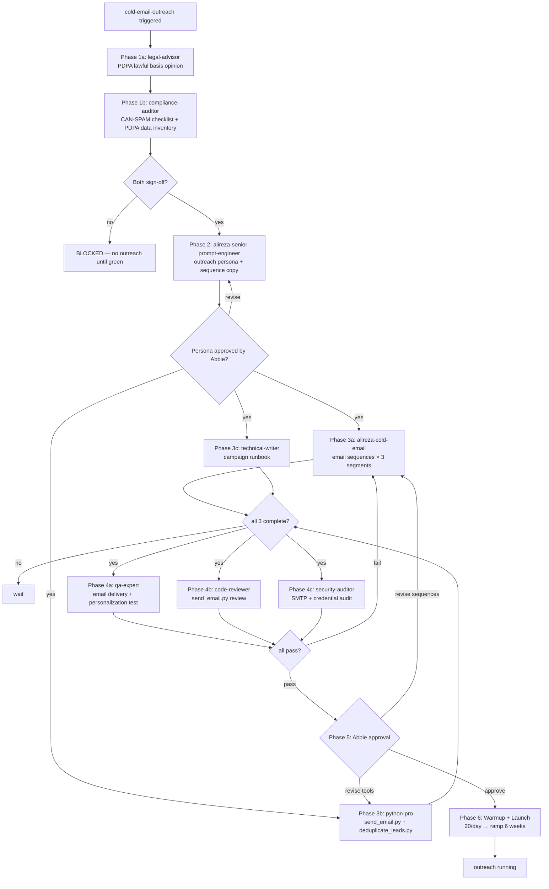

# Workflow SOP: cold-email-outreach

## Pipeline Overview

## Trigger

- Abbie requests first email campaign batch begin
- Pre-launch readiness confirmed by project-manager (deliverability setup complete, PDPA + CAN-SPAM green)

## Inputs Required

- Tanzania PDPA 2022 Lawful Basis Opinion from `legal-advisor` (must be APPROVED before Phase 2)
- CAN-SPAM compliance checklist from `compliance-auditor` (all 6 items green before Phase 2)
- `Zanzibar Prospects - Consolidated.xlsx` — 522 prospects, 14 columns
- Google Sheets lead tracker provisioned + `migrate_xlsx.py` run (data-engineer)
- Sending subdomain configured: SPF / DKIM / DMARC records active
- `SENDGRID_API_KEY` (or SMTP credentials) in `.env`
- `EMAIL_FROM_ADDRESS` in `.env`
- `ANTHROPIC_API_KEY` in `.env`

## Pipeline

**Phase 1 — Legal Gate — SEQUENTIAL (compliance-auditor runs AFTER legal-advisor):**
- Agent: `legal-advisor` — Role: Deliver PDPA Lawful Basis Opinion for 522-prospect outreach under Tanzania PDPA 2022 — Tool: WebSearch (current PDPA text), Read (email drafts) — Output: Written legal opinion with go/no-go verdict + required documentation checklist
- Gate: legal-advisor delivers GO verdict → proceed to compliance-auditor. STOP verdict → halt pipeline, escalate to Abbie with alternatives.
- Agent: `compliance-auditor` — Role: PDPA data inventory mapping + CAN-SPAM 6-item checklist against email sequences — Tool: Read (sequences, schema), Write (audit report) — Output: PDPA data inventory table + CAN-SPAM checklist with all 6 items PASS/FAIL
- Gate: Both opinions GREEN → proceed to Phase 2. Any RED item → remediate with python-pro / alireza-cold-email, re-audit. Do not proceed until both are green.

**Phase 2 — Strategy — SEQUENTIAL:**
- Agent: `alireza-senior-prompt-engineer` — Role: Design outreach persona for Dozen AI sales agent; write prompt for each of the 3 segment variants (luxury resorts, boutique/lodges, villas/apartments/guesthouses); define tone, personalization variables (hotel name, category, pain point), and reply handling instructions — Tool: Read (docs/2-context.md for product catalog + segment profiles) — Output: `docs/prompts/outreach-persona.md` + 3 segment prompt variants
- Gate: Abbie approves outreach persona tone and personalization approach before email sequences are written.

**Phase 3 — Production — PARALLEL:**
- Agent: `alireza-cold-email` — Role: Write full email sequences (3 segments × 3-email sequence = 9 email templates); configure deliverability warmup schedule (20/day → ramp over 6 weeks); specify sending rules (cadence, deduplication threshold, unsubscribe handling) — Tool: Read (outreach-persona.md, prospect segments) — Output: `docs/email-sequences/` directory with all 9 templates + `docs/email-sequences/warmup-schedule.md`
- Agent: `python-pro` — Role: Build `tools/send_email.py` (SendGrid/SMTP, personalization injection, dry-run mode) + `tools/deduplicate_leads.py` (run before every batch; flag duplicates, enforce 1-email-per-week-per-prospect rule) — Tool: Write, Bash — Output: Working `tools/send_email.py` + `tools/deduplicate_leads.py` with test suite
- Agent: `technical-writer` — Role: Document campaign runbook for operators (how to schedule a batch, how to check send status, how to handle bounces, escalation contacts) — Tool: Read, Write — Output: `docs/ops-manual/email-campaign-runbook.md`
- Gate: All three parallel outputs delivered; qa-expert has sequences + tools available for testing.

**Phase 4 — Review — PARALLEL:**
- Reviewer: `qa-expert` — Checks: Email delivery to test sandbox (Mailtrap or equivalent); personalization accuracy (right hotel name, right category, right product references) across 20-email test run; cadence timing (sends at correct intervals); deduplication (no prospect receives more than one per week); unsubscribe link present and functional
- Reviewer: `code-reviewer` — Checks: send_email.py WAT invariant compliance; no hardcoded credentials; input validation on recipient addresses (prevent header injection); confidence-scored findings (≥80 only); CLAUDE.md compliance
- Reviewer: `security-auditor` — Checks: SMTP relay security (no open relay); EMAIL_FROM_ADDRESS validated; prospect PII not logged in plaintext; .env credential loading correct
- Gate: All three reviewers PASS → proceed to Phase 5. Any CRITICAL finding → return to Phase 3 (python-pro for tool fixes, alireza-cold-email for sequence fixes). HIGH findings: fix before Phase 5, do not block immediately.

**Phase 5 — Approval Gate — SEQUENTIAL:**
- Approver: Abbie
- Review: Email sequences (tone, personalization, segment targeting); warmup schedule; tools working as expected
- Decision: approve → proceed to Phase 6 | revise sequences → back to alireza-cold-email (Phase 3) | revise tools → back to python-pro (Phase 3)
- Gate: Abbie explicit APPROVED before first real email sends. No autonomous launch.

**Phase 6 — Warmup + Launch — SEQUENTIAL:**
- Tool: `tools/send_email.py` (dry-run=False) — Destination: Prospect email addresses in Google Sheets `All Prospects` tab
- Action: `deduplicate_leads.py` runs before every batch; send_email.py sends to daily quota; `sync_lead_state.py` updates `contact_status` + `last_contacted` after each send
- Warmup: Day 1-7: 20/day. Week 2-3: 50/day. Week 4-5: 100/day. Week 6+: full volume. Adjust based on bounce rate.
- Monitoring: `data-analyst` tracks open/reply/bounce rates weekly; `project-manager` receives alert signals

## Output

- Live email campaign across 522 prospects (3 segments × 3-email sequence)
- Campaign send log written to Google Sheets `All Prospects` tab (contact_status, last_contacted, channel = "email")
- Weekly performance reports from `data-analyst` in `docs/reports/`

## Agents Referenced

- legal-advisor
- compliance-auditor
- alireza-senior-prompt-engineer
- alireza-cold-email
- python-pro
- technical-writer
- qa-expert
- code-reviewer
- security-auditor
- data-analyst
- project-manager

## MCPs / Tools Referenced

- `tools/send_email.py`
- `tools/deduplicate_leads.py`
- `tools/sync_lead_state.py`
- SendGrid API (via SENDGRID_API_KEY) or SMTP relay
- Google Sheets (via GOOGLE_SHEETS_SERVICE_ACCOUNT_JSON)
- WebSearch (legal-advisor research)

## Owner

project-manager (tracks gate compliance, escalates breaches)

## Last Updated

2026-05-07 — initial /workflow SOP authoring
