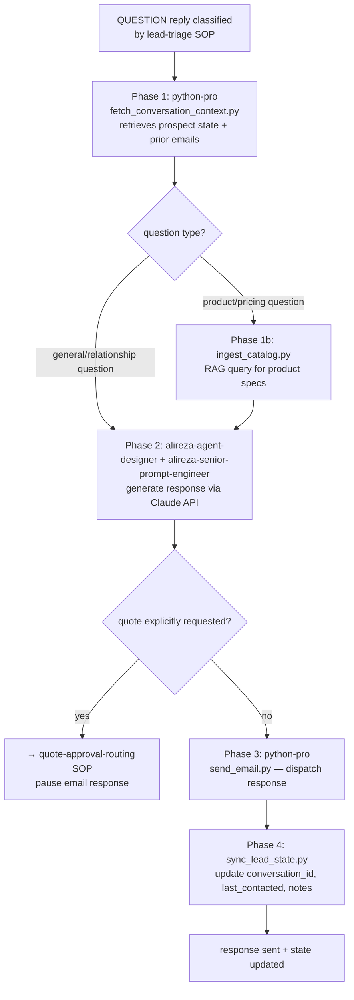

# Workflow SOP: inbound-email-response

## Pipeline Overview

## Trigger

- `lead-triage` SOP routes a reply classified as `QUESTION` to this workflow
- Prospect has asked a product, pricing, availability, or relationship question
- Must respond within business hours (target: same-day reply for replies received before 14:00 EAT)

## Inputs Required

- Prospect No. and full context from Google Sheets `All Prospects` tab (name, hotel, segment, prior emails sent)
- Reply body from `lead-triage` parsed output
- `tools/fetch_conversation_context.py` — retrieves prospect state + prior email thread
- Inbound response prompt from `alireza-senior-prompt-engineer`
- RAG query capability via `tools/ingest_catalog.py` (for product questions)
- `ANTHROPIC_API_KEY` in `.env`
- `GOOGLE_SHEETS_SERVICE_ACCOUNT_JSON` in `.env`

## Pipeline

**Phase 1 — Context Retrieval — SEQUENTIAL:**
- Agent: `python-pro` (via `tools/fetch_conversation_context.py`) — Role: Pull full prospect record from Google Sheets (hotel name, segment, contact_status, last_contacted, notes, which email sequence variant they received, what was in the email they replied to) — Tool: `tools/fetch_conversation_context.py` (deterministic) — Output: Structured context object `{prospect, hotel_segment, email_sent, reply_body, prior_conversation}`
- If question involves product specs/pricing: run RAG query via `tools/ingest_catalog.py` to retrieve relevant product data (GSM, sizes, color options, indicative price range). RAG results are appended to context object as `{catalog_context}`.
- Gate: Context object assembled → proceed to Phase 2. If prospect record not found → escalate to Abbie (data integrity issue).

**Phase 2 — Response Generation — SEQUENTIAL:**
- Agent: `alireza-agent-designer` (owns response logic design) + `alireza-senior-prompt-engineer` (owns prompt) — Role: Call Claude API with inbound response prompt + full context object; generate personalized reply in Dozen voice; if product specs cited, always flag as "indicative — final specs on request"; if any pricing mentioned, flag as "indicative pricing only — subject to confirmation"; never commit to a quote without approval — Tool: Claude API (ANTHROPIC_API_KEY) via `tools/generate_response.py` — Output: Draft response text
- WAT mandatory: agent generates response text; `python-pro` tools send and log — agent does not call the email API directly.
- Gate: Response generated → check for quote language. If response contains price commitments without approval flag: regenerate with stronger price-indicative framing. If prospect is explicitly requesting a formal quote → stop, trigger `quote-approval-routing` SOP instead.

**Phase 3 — Send — SEQUENTIAL:**
- Agent: `python-pro` (via `tools/send_email.py`) — Role: Send generated response to prospect; set reply-to to monitored inbox — Tool: `tools/send_email.py` (dry_run=False) — Output: Email sent, Message-ID logged
- Gate: Delivery confirmation received → proceed to Phase 4. Delivery failure → retry ×3, then alert project-manager.

**Phase 4 — State Sync — SEQUENTIAL:**
- Agent: `python-pro` (via `tools/sync_lead_state.py`) — Role: Update prospect record in Google Sheets: last_contacted = now, conversation_id = thread ID, notes = brief summary of what was asked + answered, response_flag = TRUE — Tool: `tools/sync_lead_state.py` — Output: Google Sheets `All Prospects` row updated
- Gate: State update confirmed → workflow complete.

## Output

- Response email sent to prospect within target window
- Google Sheets `All Prospects` updated: last_contacted, conversation_id, notes, response_flag = TRUE
- If quote request detected: `quote-approval-routing` SOP triggered (email response paused until approved quote is ready)

## Agents Referenced

- python-pro
- alireza-agent-designer
- alireza-senior-prompt-engineer
- alireza-rag-architect (catalog RAG system must be operational for product questions)
- project-manager (monitors delivery failures, response time SLA)

## MCPs / Tools Referenced

- `tools/fetch_conversation_context.py`
- `tools/generate_response.py`
- `tools/send_email.py`
- `tools/sync_lead_state.py`
- `tools/ingest_catalog.py` (RAG query for product questions)
- Claude API (via ANTHROPIC_API_KEY)
- Google Sheets API (via GOOGLE_SHEETS_SERVICE_ACCOUNT_JSON)

## Owner

alireza-agent-designer (owns response logic); python-pro (owns tool execution)

## Last Updated

2026-05-07 — initial /workflow SOP authoring
