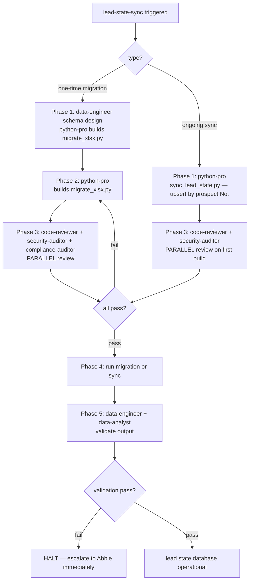

# Workflow SOP: lead-state-sync

## Pipeline Overview

## Trigger

- **One-time (setup):** After Google Sheets workspace is provisioned and `GOOGLE_SHEETS_SERVICE_ACCOUNT_JSON` is in `.env`; runs once to migrate `Zanzibar Prospects - Consolidated.xlsx` → Google Sheets
- **Ongoing (per send/reply):** `sync_lead_state.py` is called by `cold-email-outreach`, `lead-triage`, `inbound-email-response`, and `quote-approval-routing` SOPs after every state-changing event

## Inputs Required

- **One-time migration:**
  - `Zanzibar Prospects - Consolidated.xlsx` (522 prospects, 14 columns) — at project root
  - Google Sheets workspace created with correct sharing permissions
  - `GOOGLE_SHEETS_SERVICE_ACCOUNT_JSON` + `GOOGLE_SHEETS_ID` in `.env`
  - Schema spec from `data-engineer`
- **Ongoing sync:**
  - Structured state update object from calling SOP (prospect No., field to update, new value)
  - `GOOGLE_SHEETS_SERVICE_ACCOUNT_JSON` + `GOOGLE_SHEETS_ID` in `.env`

## Pipeline

### Sub-path A — One-time Migration (run once at project setup)

**Phase 1 — Schema Design — SEQUENTIAL:**
- Agent: `data-engineer` — Role: Define Google Sheets structure: `All Prospects` tab (14 original columns + 7 state columns: contact_status, channel, last_contacted, conversation_id, response_flag, quote_requested, notes); `Discovery Runs` tab schema; `Campaign Stats` tab aggregates — Tool: Write (schema doc at `docs/architecture/lead-state-schema.md`) — Output: Complete schema documented + Google Sheets tabs created with headers
- Gate: Schema approved by Abbie before migration runs. Schema doc at `docs/architecture/lead-state-schema.md` exists.

**Phase 2 — Build Migration Tool — SEQUENTIAL:**
- Agent: `python-pro` — Role: Build `tools/migrate_xlsx.py`: read xlsx via openpyxl, map 14 original columns to Sheets headers, add 7 state columns (all defaulting to empty/NOT_CONTACTED), upsert by prospect No. (idempotent — safe to re-run), log row count before + after — Tool: Write, Bash — Output: Working `tools/migrate_xlsx.py` with test on 5-row sample

**Phase 3 — Review — PARALLEL:**
- Reviewer: `code-reviewer` — Checks: WAT invariant (no direct AI execution), idempotency logic correct, no hardcoded credentials, confidence ≥80 findings only
- Reviewer: `security-auditor` — Checks: PII (prospect emails, phones) handled correctly; no logging of raw PII; .env credentials loaded via python-dotenv
- Reviewer: `compliance-auditor` — Checks: All 7 state columns present per PDPA data inventory; data retention period field present; no excess PII fields
- Gate: All three PASS → proceed to Phase 4. Any CRITICAL → back to python-pro (Phase 2).

**Phase 4 — Run Migration — SEQUENTIAL:**
- Action: `python-pro` runs `tools/migrate_xlsx.py` (dry_run=True first, then dry_run=False after Abbie confirms dry run output)
- Gate: Dry run output matches expected row count (522) and headers → Abbie approves live run.

**Phase 5 — Validation — PARALLEL:**
- Agent: `data-engineer` — Role: Spot-check 10 random rows against source xlsx; verify all 14 original columns preserved; verify 7 state columns present with correct defaults
- Agent: `data-analyst` — Role: Confirm Campaign Stats tab aggregates are computable (test 2 sample queries against data)
- Gate: Both validations pass → migration complete. Any discrepancy → HALT, escalate to Abbie immediately (data loss protocol).

### Sub-path B — Ongoing State Sync (called by other SOPs)

**Phase 1 — Sync — SEQUENTIAL (per event):**
- Agent: `python-pro` (via `tools/sync_lead_state.py`) — Role: Upsert by prospect No. (never delete); accept state update object from calling SOP; write to correct row/column in `All Prospects` tab; log change (timestamp, field, old value, new value) to audit log — Tool: `tools/sync_lead_state.py` (deterministic; no AI) — Output: Google Sheets row updated; audit log entry appended
- Concurrency: If two tools write to the same row simultaneously, last write wins; audit log captures both writes
- Gate: Confirmation from Sheets API → sync complete. API error → retry ×3 with exponential backoff → alert project-manager.

## Output

- **One-time:** Google Sheets `All Prospects` tab with all 522 prospects + 7 state columns; `Discovery Runs` tab; `Campaign Stats` tab — all operational
- **Ongoing:** Per-event state update written to Sheets; audit log entry per change
- `docs/architecture/lead-state-schema.md` — schema documentation

## Agents Referenced

- data-engineer
- python-pro
- code-reviewer
- security-auditor
- compliance-auditor
- data-analyst
- project-manager (monitors sync failures; escalates data loss events)

## MCPs / Tools Referenced

- `tools/migrate_xlsx.py`
- `tools/sync_lead_state.py`
- `/xlsx` skill (for xlsx ingestion support)
- Google Sheets API (via GOOGLE_SHEETS_SERVICE_ACCOUNT_JSON)

## Owner

data-engineer (owns schema + migration); python-pro (owns tool implementation)

## Last Updated

2026-05-07 — initial /workflow SOP authoring
