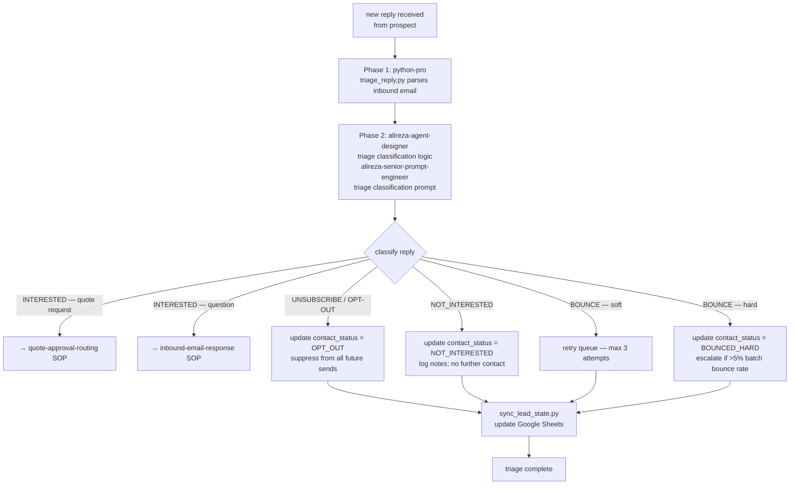

# Workflow SOP: lead-triage

## Pipeline Overview

## Trigger

- Inbound email reply detected in monitored inbox (reply-to address for outreach domain)
- Automated: `monitor_inbox.py` polls for new replies (to be built by python-pro); triggers this SOP per reply
- Manual fallback: Abbie flags a reply for triage if automation is not yet active

## Inputs Required

- Reply-to inbox access configured (email monitoring for outreach subdomain)
- `tools/triage_reply.py` — parses reply metadata (sender, subject, body, bounce code if applicable)
- `tools/sync_lead_state.py` — updates Google Sheets contact_status, response_flag, notes
- Triage classification prompt from `alireza-senior-prompt-engineer` (written during cold-email-outreach SOP Phase 2)
- `ANTHROPIC_API_KEY` in `.env`
- `GOOGLE_SHEETS_SERVICE_ACCOUNT_JSON` in `.env`

## Pipeline

**Phase 1 — Parse — SEQUENTIAL:**
- Agent: `python-pro` (via `tools/triage_reply.py`) — Role: Parse inbound email (sender email, prospect No. lookup in Sheets, reply body, bounce type if hard/soft) — Tool: `tools/triage_reply.py` (deterministic, no AI) — Output: Structured reply object `{prospect_id, sender_email, body, reply_type_hint, bounce_code}`
- Gate: Parsed reply object available → proceed to Phase 2. Unparseable reply (malformed email) → log to error queue, notify project-manager.

**Phase 2 — Classify — SEQUENTIAL:**
- Agent: `alireza-agent-designer` owns classification logic design; `alireza-senior-prompt-engineer` wrote the classification prompt — Role: AI classifies reply into: QUOTE_REQUEST | QUESTION | UNSUBSCRIBE | NOT_INTERESTED | BOUNCE_SOFT | BOUNCE_HARD — Tool: `tools/triage_reply.py` calls Claude API with classification prompt — Output: Classification label + confidence score + extracted key information (e.g., specific product asked about, quote parameters mentioned)
- Gate: Classification returned with confidence ≥ 0.8 → proceed to routing. Confidence < 0.8 → flag for Abbie manual review before acting.

**Phase 3 — Route + State Update — PARALLEL:**
- Per classification:
  - `QUOTE_REQUEST` → trigger `quote-approval-routing` SOP; update contact_status = QUOTE_REQUESTED, response_flag = TRUE
  - `QUESTION` → trigger `inbound-email-response` SOP; update response_flag = TRUE
  - `UNSUBSCRIBE` → update contact_status = OPT_OUT; suppress from all future sends (checked by deduplicate_leads.py)
  - `NOT_INTERESTED` → update contact_status = NOT_INTERESTED; log notes
  - `BOUNCE_SOFT` → add to retry queue; retry after 48h; max 3 attempts then BOUNCED_HARD
  - `BOUNCE_HARD` → update contact_status = BOUNCED_HARD; remove from all future batches; if batch bounce rate >5% → escalate to Abbie + alireza-cold-email immediately
- Tool: `tools/sync_lead_state.py` — updates Google Sheets `All Prospects` tab columns: contact_status, response_flag, last_contacted, notes
- Gate: State update confirmed in Sheets → triage complete. Sync failure → retry 3× then alert project-manager.

## Output

- Google Sheets `All Prospects` tab updated with correct contact_status per reply
- Downstream SOPs triggered (quote-approval-routing or inbound-email-response) as applicable
- Opt-out suppression list maintained (contact_status = OPT_OUT → excluded from all future sends by deduplicate_leads.py)
- Bounce rate monitored by data-analyst; >5% triggers immediate escalation

## Agents Referenced

- python-pro
- alireza-agent-designer
- alireza-senior-prompt-engineer
- data-analyst (receives bounce rate signal for escalation trigger)
- project-manager (monitors error queue, bounce threshold alerts)

## MCPs / Tools Referenced

- `tools/triage_reply.py`
- `tools/sync_lead_state.py`
- `tools/deduplicate_leads.py` (opt-out enforcement at send time)
- Claude API (via ANTHROPIC_API_KEY) — classification prompt
- Google Sheets API (via GOOGLE_SHEETS_SERVICE_ACCOUNT_JSON)

## Owner

alireza-agent-designer (owns classification logic); python-pro (owns tool implementation)

## Last Updated

2026-05-07 — initial /workflow SOP authoring
