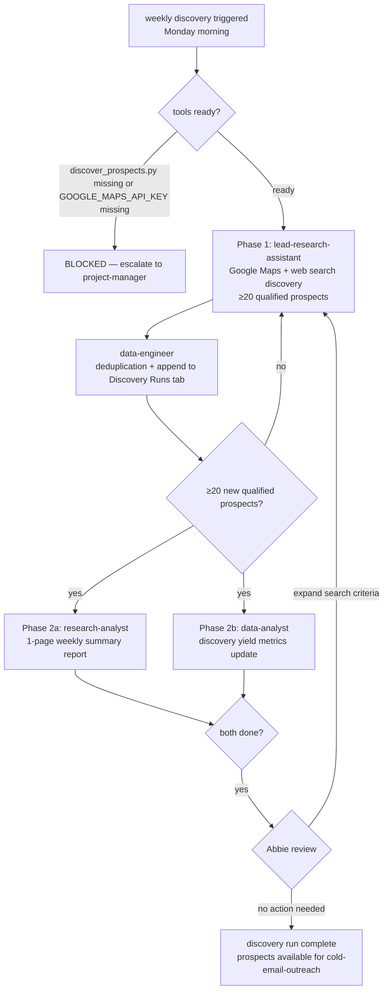

# Workflow SOP: prospect-discovery

## Pipeline Overview

## Trigger

- Weekly recurring: every Monday morning (or on-demand if prospect pipeline drops below 50 prospects with `contact_status = NOT_CONTACTED`)
- First run: after `migrate_xlsx.py` has loaded 522 base prospects into Google Sheets — discovery adds incremental new leads

## Inputs Required

- `tools/discover_prospects.py` — built by `python-pro`, tested by `qa-expert`
- `GOOGLE_MAPS_API_KEY` in `.env` (currently ❌ not provisioned — blocks this SOP)
- `ANTHROPIC_API_KEY` in `.env`
- `GOOGLE_SHEETS_SERVICE_ACCOUNT_JSON` in `.env` (for appending to Discovery Runs tab)
- ICP definition from `docs/2-context.md`: hotel procurement managers, Zanzibar, 3 segments
- Existing prospect list in Google Sheets `All Prospects` tab (for deduplication)

## Pipeline

**Phase 1 — Discovery Run — SEQUENTIAL:**
- Agent: `lead-research-assistant` — Role: Run weekly ICP-based discovery using `discover_prospects.py`; search Google Maps for hotels in Zanzibar; enrich with web search for procurement manager contact details; score each prospect 1-10 for ICP fit; flag as QUALIFIED (score ≥6) or BELOW_THRESHOLD — Tool: `tools/discover_prospects.py` (GOOGLE_MAPS_API_KEY), Tavily (web enrichment) — Output: List of ≥20 qualified new prospects with: hotel name, address, phone, website, estimated category (luxury/boutique/villa), ICP fit score, notes
- Agent: `data-engineer` — Role: Deduplicate against existing All Prospects tab; append only genuinely new prospects to `Discovery Runs` tab; log run date, source, count — Tool: Google Sheets API (GOOGLE_SHEETS_SERVICE_ACCOUNT_JSON) — Output: `Discovery Runs` tab updated with new row per run; zero duplicate records
- Gate: ≥20 qualified new prospects appended without duplicates → proceed to Phase 2. If <20 qualified: lead-research-assistant expands search radius or tries alternate search terms; rerun before proceeding.

**Phase 2 — Reporting — PARALLEL:**
- Agent: `research-analyst` — Role: Write 1-page weekly discovery summary (format: 3 numbers + 1 insight + 1 recommended action); include hotel category breakdown, notable findings, any market signals observed — Tool: Read (Discovery Runs tab output) — Output: `docs/reports/discovery-week-[N].md`
- Agent: `data-analyst` — Role: Update discovery yield metrics (prospects found per run, fit score distribution, category mix) in Campaign Stats tab — Tool: Google Sheets (GOOGLE_SHEETS_SERVICE_ACCOUNT_JSON) — Output: Updated `Campaign Stats` tab with discovery metrics
- Gate: Both reports complete → deliver to Abbie. No blocking gate; Abbie reviews asynchronously.

**Phase 3 — Abbie Review — HUMAN GATE:**
- Approver: Abbie (async review, weekly)
- Decision: no action → discovery run complete | expand criteria → research-analyst + lead-research-assistant adjust ICP filters, rerun Phase 1
- Gate: Abbie has visibility into pipeline health; no explicit approval needed unless criteria change requested.

## Output

- New prospects in Google Sheets `Discovery Runs` tab (≥20 per weekly run)
- Weekly discovery summary in `docs/reports/discovery-week-[N].md`
- Updated discovery yield metrics in `Campaign Stats` tab
- Prospects available for ingestion into `cold-email-outreach` pipeline

## Agents Referenced

- lead-research-assistant
- data-engineer
- research-analyst
- data-analyst
- project-manager (monitors GOOGLE_MAPS_API_KEY dependency; tracks weekly run completion)

## MCPs / Tools Referenced

- `tools/discover_prospects.py`
- Google Maps Places API (via GOOGLE_MAPS_API_KEY)
- Tavily MCP (web enrichment)
- Google Sheets API (via GOOGLE_SHEETS_SERVICE_ACCOUNT_JSON)

## Owner

lead-research-assistant (runs discovery); project-manager (monitors cadence and blockers)

## Last Updated

2026-05-07 — initial /workflow SOP authoring
