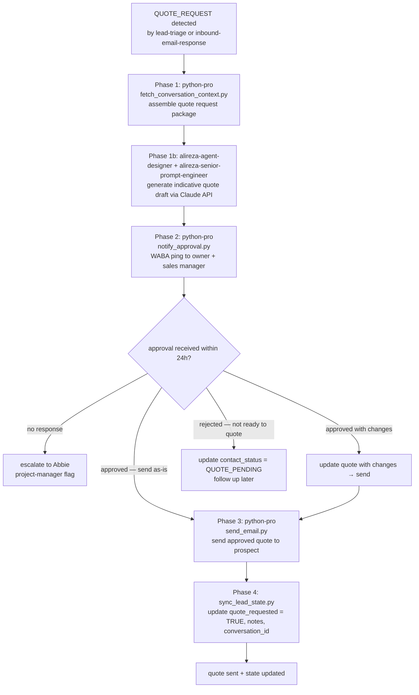

# Workflow SOP: quote-approval-routing

## Pipeline Overview

## Trigger

- `lead-triage` classifies reply as `QUOTE_REQUEST`
- `inbound-email-response` detects explicit quote request in prospect message mid-conversation
- Prospect submits request-a-quote form on dozensupplies.com (website-sprint SOP routes this here)

## Inputs Required

- Prospect No. and full conversation context from Google Sheets
- `tools/notify_approval.py` — WABA ping to owner (+255 772 502 076) + sales manager
- `WABA_PHONE_NUMBER_ID` + `WABA_ACCESS_TOKEN` in `.env` (currently ❌ not provisioned — this SOP is BLOCKED until WABA is provisioned; use email fallback to owner in interim)
- `ANTHROPIC_API_KEY` in `.env`
- Product catalog RAG (via `tools/ingest_catalog.py`) for accurate product specs in quote draft
- `GOOGLE_SHEETS_SERVICE_ACCOUNT_JSON` in `.env`

## Pipeline

**Phase 1 — Quote Preparation — SEQUENTIAL:**
- Agent: `python-pro` (via `tools/fetch_conversation_context.py`) — Role: Assemble full context: prospect hotel, segment, what products they asked about, conversation history, any size/quantity/spec preferences mentioned — Tool: `tools/fetch_conversation_context.py` + `tools/ingest_catalog.py` (RAG query for relevant product specs) — Output: Quote request package `{prospect, hotel, products_requested, specs, conversation_summary}`
- Agent: `alireza-agent-designer` + `alireza-senior-prompt-engineer` — Role: Generate indicative quote draft via Claude API — must include: product name, GSM/size options, indicative price range (NOT a firm price), lead time estimate, MOQ, next steps. Must include explicit "INDICATIVE PRICING ONLY — subject to confirmation" language in every price mention — Tool: Claude API (ANTHROPIC_API_KEY) via `tools/generate_quote_draft.py` — Output: Draft quote email text (NEVER sent without owner approval)
- Gate: Quote draft assembled → proceed to Phase 2 immediately (do not send). If product info not in RAG → flag to Abbie; request product spec clarification before proceeding.

**Phase 2 — Owner + Sales Manager Approval — SEQUENTIAL:**
- Agent: `python-pro` (via `tools/notify_approval.py`) — Role: Send WhatsApp message to owner (+255 772 502 076) AND sales manager containing: prospect name, hotel, products requested, draft quote text, two options: APPROVE (send as-is) / REQUEST CHANGES (reply with changes) — Tool: `tools/notify_approval.py` (Meta WABA API) — Output: WhatsApp notification sent; 24h approval window starts
- **WABA FALLBACK (until provisioned):** Send approval request via email to owner + sales manager using `tools/send_email.py`. Include same content. Mark email as [APPROVAL REQUIRED] in subject line.
- Gate: Approval or CHANGES response received from owner OR sales manager within 24h → proceed. No response within 24h → project-manager escalates to Abbie. Rejected/HOLD → update contact_status = QUOTE_PENDING, schedule follow-up.

**Phase 3 — Send Approved Quote — SEQUENTIAL:**
- Agent: `python-pro` (via `tools/send_email.py`) — Role: Send approved quote to prospect (with any modifications from owner); quote must still contain "indicative pricing only" language even after approval — Tool: `tools/send_email.py` — Output: Quote email sent to prospect
- Gate: Delivery confirmation → proceed to Phase 4.

**Phase 4 — State Sync — SEQUENTIAL:**
- Agent: `python-pro` (via `tools/sync_lead_state.py`) — Role: Update Google Sheets: quote_requested = TRUE, contact_status = QUOTE_SENT, last_contacted = now, notes = "Sent indicative quote for [products]", conversation_id = thread ID — Tool: `tools/sync_lead_state.py` — Output: Google Sheets updated
- Gate: Sync confirmed → workflow complete.

## Output

- Approved indicative quote sent to prospect
- Google Sheets updated: quote_requested = TRUE, contact_status = QUOTE_SENT
- Owner + sales manager have approved every quote before it leaves (zero exception)

## Agents Referenced

- python-pro
- alireza-agent-designer
- alireza-senior-prompt-engineer
- alireza-rag-architect (catalog RAG must be operational for accurate product specs in quote)
- security-auditor (audits notify_approval.py for WABA API credential handling)
- legal-advisor (reviewed WABA policy; quote language must remain indicative)
- project-manager (monitors 24h approval window; escalates non-responses)

## MCPs / Tools Referenced

- `tools/fetch_conversation_context.py`
- `tools/generate_quote_draft.py`
- `tools/notify_approval.py`
- `tools/send_email.py`
- `tools/sync_lead_state.py`
- `tools/ingest_catalog.py` (RAG — product specs)
- Meta WABA API (via WABA_PHONE_NUMBER_ID + WABA_ACCESS_TOKEN) — or email fallback
- Claude API (via ANTHROPIC_API_KEY)
- Google Sheets API (via GOOGLE_SHEETS_SERVICE_ACCOUNT_JSON)

## Owner

alireza-agent-designer (owns quote logic); project-manager (owns approval window monitoring)

## Last Updated

2026-05-07 — initial /workflow SOP authoring
