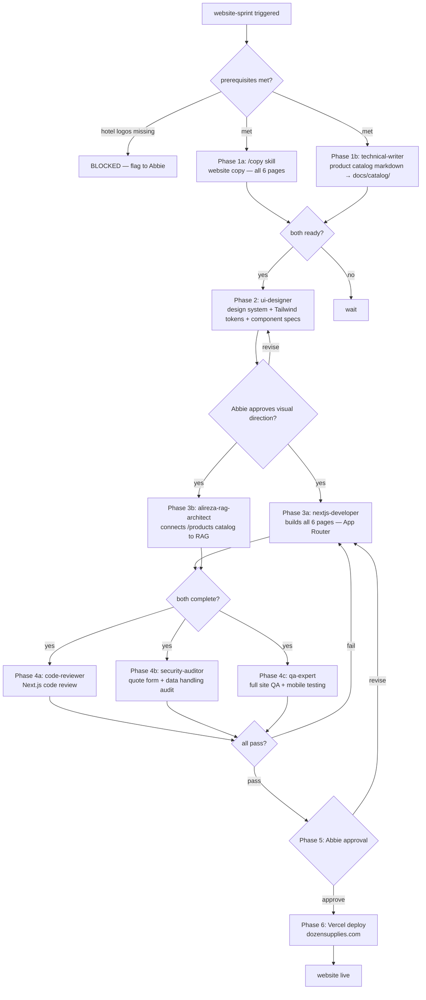

# Workflow SOP: website-sprint

## Pipeline Overview

## Trigger

- Abbie authorizes website sprint to begin
- Prerequisites confirmed: ui-designer inputs available (brand references, competitor refs), catalog markdown ready, hotel logos received from Dozen

## Inputs Required

- Brand reference: Dozen Instagram (@dozen.supplies_zanzibar) for existing visual style
- Competitor references: TUI Blue, LUX*, Neptune Hotels (hotel clients — understand their aesthetic)
- Product catalog PDFs from Dozen (for technical-writer to produce catalog markdown)
- 30+ hotel client logos from Dozen (PNG/SVG — for /clients logo wall; without these, /clients page blocked)
- Website copy (to be produced by `/copy` skill in Phase 1)
- Quote flow routing spec from `alireza-agent-designer` (how /quote form connects to AI handler)
- `ANTHROPIC_API_KEY` in `.env` (for RAG-connected product pages)

## Pipeline

**Phase 1 — Content Preparation — PARALLEL:**
- Skill: `/copy` — Role: Write website copy for all 6 pages (/, /products, /products/[category], /clients, /about, /quote) — Output: `docs/website-copy.md` with per-page copy, tone, CTAs
- Agent: `technical-writer` — Role: Produce structured product catalog markdown from PDFs (one file per category: towels.md, bed-linen.md, bedding.md, fb-supplies.md, bathrobes.md, slippers.md, kitchen-sanitation.md) — Tool: Read (PDFs), Write — Output: `docs/catalog/*.md` (7 files)
- Gate: Both outputs complete → proceed to Phase 2. If catalog PDFs not provided by Dozen → block Phase 3b (RAG) but allow Phase 2 (design) to proceed with placeholder content. Flag to Abbie.

**Phase 2 — Design System — SEQUENTIAL:**
- Agent: `ui-designer` — Role: Design premium B2B hospitality visual system: color palette (from Instagram brand analysis), typography (serif recommendation for luxury hospitality context), spacing system, Tailwind design tokens; write component specs for all sections (hero, catalog grid, logo wall, about, quote form); include accessibility annotations (WCAG 2.1 AA); specify exact Tailwind classes for all states and responsive breakpoints (375px mobile + 1440px desktop) — Tool: Read (brand references, competitor sites via browser-use), Write — Output: `docs/design-system.md` with all tokens + component specs
- Gate: Abbie approves visual direction (color palette, typography, overall premium hospitality aesthetic) before nextjs-developer begins building. Max 2 rounds of revision; if no approval after 2 rounds → escalate to Abbie for direction decision.

**Phase 3 — Build — PARALLEL:**
- Agent: `nextjs-developer` — Role: Build complete Next.js 14+ App Router application in `website/` directory; implement all 6 pages with exact Tailwind classes from ui-designer specs; image optimization (catalog photos, hotel logos via next/image); SEO (Metadata API, sitemap.xml, structured data, Open Graph); Core Web Vitals target ≥90 Lighthouse on all 4 categories; quote form routes to AI handler endpoint — Tool: Bash (npm, next), Write — Output: Working Next.js application in `website/` with all pages
- Agent: `alireza-rag-architect` — Role: Build RAG connection for /products catalog pages: product queries from website → `tools/ingest_catalog.py` → vector store → response — Tool: Read (catalog markdown), Write — Output: RAG endpoint functional; `/products/[category]` pages can answer product spec questions
- Gate: Both outputs complete, `npm run build` passes, no TypeScript errors → proceed to Phase 4.

**Phase 4 — Review — PARALLEL:**
- Reviewer: `code-reviewer` — Checks: TypeScript strict mode compliance; no hardcoded credentials in website/ code; WAT compliance (quote form posts to API route, not directly to AI); confidence-scored findings ≥80; CLAUDE.md compliance
- Reviewer: `security-auditor` — Checks: Quote form CSRF protection; XSS sanitization on all user inputs; no API keys exposed in client-side bundle; HTTPS enforced; form data handling GDPR/PDPA-adjacent best practices
- Reviewer: `qa-expert` — Checks: All 6 pages load on iPhone 14 + Samsung Galaxy S23 in <3 seconds on 4G; all links functional (no 404s); quote form submission triggers correct AI handler response; logo wall displays all 30+ logos without layout break; all product lines display with correct specs; /webapp-testing Playwright suite passing
- Gate: All three PASS → proceed to Phase 5. Any CRITICAL finding → back to nextjs-developer (Phase 3). HIGH findings: fix before Phase 5.

**Phase 5 — Approval Gate — SEQUENTIAL:**
- Approver: Abbie (design/content review) + Dozen owner (factual accuracy of about page, product specs)
- Decision: approve → deploy | revise content → back to Phase 3 (nextjs-developer) | revise design → discuss with ui-designer
- Gate: Both Abbie + Dozen owner explicit APPROVED before production deploy.

**Phase 6 — Deploy — SEQUENTIAL:**
- Tool: Vercel CLI (`vercel --prod`) or Vercel dashboard — Destination: dozensupplies.com
- DNS migration: coordinate with Dozen on timing; use preview URL for stakeholder review before DNS cutover
- Post-deploy: run Lighthouse audit in production; confirm Core Web Vitals all ≥90; verify quote form end-to-end in production

## Output

- Live dozensupplies.com with all 6 pages, product catalog, logo wall, quote flow
- `website/` directory in project root (Next.js 14+ App Router)
- Lighthouse score ≥90 all 4 categories
- Mobile-first: all pages verified on iPhone 14 + Samsung Galaxy S23

## Agents Referenced

- ui-designer
- technical-writer
- nextjs-developer
- alireza-rag-architect
- code-reviewer
- security-auditor
- qa-expert
- project-manager (tracks logo dependency from Dozen; tracks sprint progress)

## MCPs / Tools Referenced

- `/copy` skill (website copywriting)
- browser-use MCP (ui-designer competitor site analysis; qa-expert Playwright testing)
- Figma MCP (ui-designer design handoff, if Figma used for specs)
- `tools/ingest_catalog.py` (RAG — product catalog)
- Vercel CLI (deployment)

## Owner

nextjs-developer (build); ui-designer (design); project-manager (sprint coordination)

## Last Updated

2026-05-07 — initial /workflow SOP authoring
